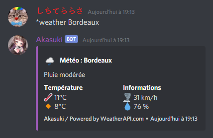
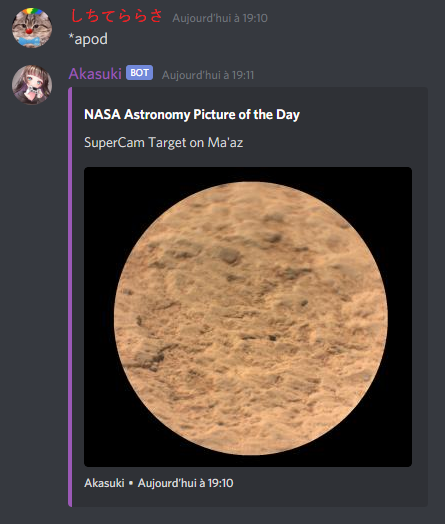

# Akasuki
> Simple and funny little Java Discord bot, build with Discord4J.

## Table of contents
* [General info](#general-info)
* [Screenshots](#screenshots)
* [Technologies](#technologies)
* [Setup](#setup)
* [Features](#features)
* [Status](#status)
* [Inspiration](#inspiration)
* [Support](#support)
* [NB](#nb)
* [Contact](#contact)

## General info
This project is an LGBT-friendly bot called Akasuki, it can find you gifs to let you express yourself, 
help you in the moderation of your server, or even encourage your members to 
be active via a system of inventories, rewards and levels!

## Screenshots




## Technologies
Akasuki is created with:
* Discord4J
* Lavaplayer
* SLF4J
* Sentry
* Prometheus
* Javaluator
* Giphy4J
* Maven
* ImageJ
* JUnit
* Json-Simple
	
## Setup  
```
$ git clone https://github.com/Akasuki-Bot/Akasuki.git
$ cd ./Akasuki
$ mvn clean install
$ touch config.properties
$ vim config.properties

# suppress inspection "SpellCheckingInspection" for whole file
#
# -------------------------------------------------------------- #
# -------------------| Akasuki Config File |-------------------- #
# -------------------------------------------------------------- #
#
# -------------| Links Config
github.url=https://github.com/Akasuki-bot/Akasuki
support.server.url=https://discord.gg/973paeN
invite.url=https://discord.com/api/oauth2/authorize?client_id=746742167594074132&permissions=8&scope=bot

# -------------| Main Config
akasuki.prefix=
akasuki.token=

# -------------| Api Keys
api.nasa=
api.giphy=
api.weatherapi=
api.sentryio.url=
~
~

$ java -jar Akasuki-jar-with-dependencies.fr
```
> **Please note : We wil not provide any support for self-hosting the bot and how get it working**

## Features

Features on the stable version
* Randoms gif (*kiss, *hug, etc)
* UserInfo

To-do list:
* Marry
* More gifs
* Prefix customization
* Module system
* Inventory and items system
* Moderation (*ban, *kick, *warn etc)

## Status
Maintained as 2021

## Inspiration
The gif system is inspired by [Koya](https://koya.gg/) <br>
The inventory system is inspired by PWK (private bot)

## Support
If you need help with Akasuki **(not about self-hosting)**, how to config it or if you find any bugs join us on the [Discord](https://discord.com/invite/973paeN)

## NB
I know at the beginning of this project some Discord token and database id leaked, these id had been changed a long time ago, and the IPs have changed. <br>
This is no longer a security flaw, the problem has been solved.

## Contact
Created by [@Dawoox](https://www.github.com/dawoox) - feel free to contact me!