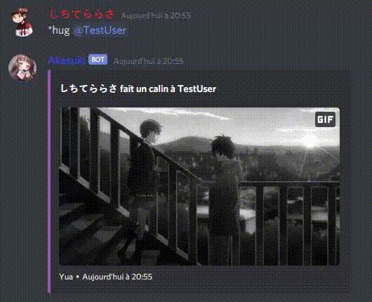

# Akasuki
> Simple and funny little Java Discord bot, build with Discord4J.

This page is available in [French](./translations/french.md)

## Table of contents
* [General info](#general-info)
* [Screenshots](#screenshots)
* [Technologies](#technologies)
* [Setup](#setup)
* [Features](#features)
* [Status](#status)
* [Inspiration](#inspiration)
* [Support](#support)
* [NB](#nb)
* [Contact](#contact)

## General info
This project is an LGBT-friendly bot called Akasuki, it can find you gifs to let you express yourself, 
help you in the moderation of your server, or even encourage your members to 
be active via a system of inventories, rewards and levels!

## Screenshots




## Technologies
Akasuki is created with:
* Discord4J: 3.1.1
* Lavaplayer: 1.3.50
* Logback: 1.2.3
* MongoDB Sync Driver: 4.1.0
* Maven Compiler: 3.8.1
* ImageJ: 1.53e
* Rssreader: 2.3.1
	
## Setup  
```
$ git clone https://github.com/Dawoox/Akasuki.git
$ cd ./Akasuki
$ mvn clean install
$ touch config.properties
$ vim config.properties

token={your bot token}
db_user={your database username}
db_passwd={your database password}
db_ip={ip adress of your database}
db_retry={true/false the db will retry to connect if the connexion crash}
db_main={the name of the database}
~
~

$ java -jar Akasuki-jar-with-dependencies.fr
```
> **Please note : We wil not provide any support for self-hosting the bot and how get it working**

## Features

Features on the stable version
* Randoms gif (*kiss, *hug, etc)
* UserInfo
* Moderation (*ban, *kick, *warn etc)

To-do list:
* Marry
* More gifs
* Prefix customization
* Module system
* Inventory and items system

## Status
Maintained

## Inspiration
The gif system is inspired by [Koya](https://koya.gg/) <br>
The database side of the inventory system is inspired by PWK (it's a private bot)

## Support
If you need help with Akasuki, how to config it or if you find any bugs join us on the [Discord](https://discord.com/invite/973paeN)

## NB
I know at the beginning of this project some Discord token and database id leaked, these id had been changed a long time ago, and the IPs have changed. <br>
This is no longer a security flaw, the problem has been solved.

## Contact
Created by [@Dawoox](https://www.github.com/dawoox) - feel free to contact me!