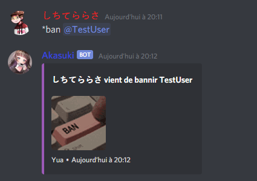
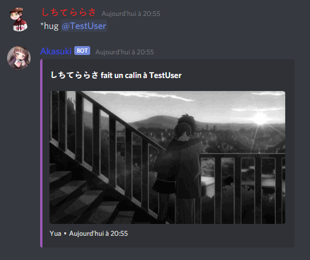
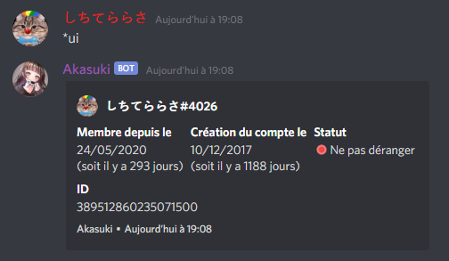

# Akasuki
> Un bot Discord fait en java simple et amusant, construit via Discord4J.

Cette page est traduite en [Anglais](../readme.md)

## Sommaire
* [Informations](#Informations)
* [Captures d'écrans](#captures-dcran)
* [Technologies](#technologies)
* [Installation](#installation)
* [Fonctionnalités](#fonctionnalits)
* [Status](#statut)
* [Inspiration](#inspiration)
* [Support](#support)
* [NB](#nb)
* [Contact](#contact)

## Informations
Ce projet est un bot tolérant LGBT appelé Akasuki, elle peut vous trouver des gifs pour vous permettre de vous exprimer, 
vous aider dans la modération de votre serveur, ou même encourager vos membres à 
être actif via un système d'inventaires, de récompenses et de niveaux !

## Captures d'écran




## Technologies
Akasuki est crée grâce à:
* Discord4J: 3.1.1
* Lavaplayer: 1.3.50
* Logback: 1.2.3
* MongoDB Sync Driver: 4.1.0
* Maven Compiler: 3.8.1
	
## Installation  
```
$ git clone https://github.com/Dawoox/Akasuki.git
$ cd ./Akasuki
$ mvn clean install
$ touch config.properties
$ vim config.properties

token={your bot token}
db_user={your database username}
db_passwd={your database password}
db_ip={ip adress of your database}
db_retry={true/false the db will retry to connect if the connexion crash}
db_main={the name of the database}
~
~

$ java -jar Akasuki-jar-with-dependencies.fr
```
> **Attention : Nous ne donnons aucune aide sur comment exécuter le bot vous-même et comment le faire fonctionner**

## Fonctionnalités

####Fonctions de la version stable
* Gif aléatoires (*kiss, *hug, etc)
* Informations sur un utilisateur
* Moderation (*ban, *kick, *warn etc)

####To-do list:
* Mariage
* Plus de gif
* Prefix personnalisé
* Système de module
* Système d'inventaire

## Statut
Maintained

## Inspiration
Le système de gif est inspiré de [Koya](https://koya.gg/) <br>
La gestion de la base de données pour le système d'inventaire vient de PWK (un bot privé)

## Support
Si vous avez besoin d'aide avec Akasuki, sur comment la configurer ou si vous avez trouvé des bugs, venez sur le [Discord](https://discord.com/invite/973paeN)

## NB
Je suis au courant des mots de passe et identifiants qui ont fuités au début du projets, ils ont étaient modifiés depuis.
Ce n'est plus une faille de sécurité.

## Contact
Crée par [@Dawoox](https://www.github.com/dawoox) - n'hésitez pas a me contacter!